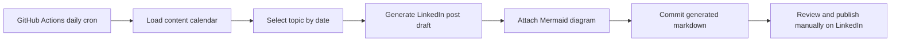

# Daily LinkedIn Post Workflow

> Portfolio recreation using synthetic content prompts and public-safe documentation. This workflow creates LinkedIn-ready daily post drafts; it does not automatically post to LinkedIn without separate LinkedIn API authorization.

## What This Demonstrates

This project demonstrates a scheduled content workflow for maintaining a consistent technical presence on LinkedIn. It uses GitHub Actions to run every day, select a topic from a data engineering content calendar, generate a polished post draft, include a Mermaid architecture diagram, and commit the daily draft back into the repository.

## Business Problem

A strong LinkedIn presence is easier to maintain when the process is systematized. Instead of waiting for inspiration, this workflow treats professional content like a lightweight data product: planned topics, reusable templates, scheduled generation, review-ready outputs, and consistent documentation.

## Architecture



## Implementation Details

- Runs daily from GitHub Actions using a cron schedule.
- Uses a curated content calendar focused on data engineering, governance, analytics, revenue data, and healthcare ML.
- Generates a LinkedIn-ready post with a hook, short technical explanation, architecture diagram, and practical takeaway.
- Writes date-stamped drafts under `generated/`.
- Updates `generated/latest-linkedin-post.md` so the newest draft is easy to find.
- Keeps publishing manual to avoid accidental posting and to comply with LinkedIn authorization requirements.

## Production Equivalent Patterns

- Content operations workflow for technical leadership and personal brand building
- Scheduled automation using GitHub Actions, Airflow, Prefect, or cloud-native schedulers
- Template-based generation with review checkpoints
- Diagram-as-code documentation using Mermaid
- Audit trail through git commits

## Run Locally

```bash
python3 generate_daily_post.py
```

To generate a draft for a specific date:

```bash
python3 generate_daily_post.py --date 2026-08-27
```

## LinkedIn Project Summary

Built a scheduled content workflow that generates daily LinkedIn-ready technical posts for a senior data engineering profile. The workflow uses a content calendar, repeatable post templates, Mermaid diagrams, GitHub Actions scheduling, and review-ready markdown outputs.

## Public Safety Note

Generated posts are based on general data engineering patterns and portfolio projects. They do not include employer confidential data, customer records, patient data, credentials, or private architecture.
