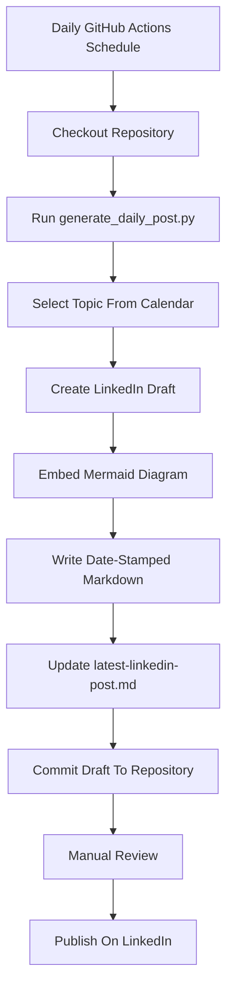

# Scheduled LinkedIn Content Workflow Diagram

## Review Gate

The workflow intentionally stops at draft generation. Automated publishing to LinkedIn should only be added after the account has an approved LinkedIn API integration, proper user authorization, and a final human review step.
