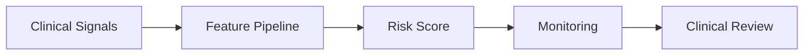

# LinkedIn Post Draft - 2026-08-27

Theme: Healthcare ML

## Post Copy

In healthcare analytics, the model is only one part of the system.

A readmission risk workflow needs secure data handling, feature engineering, batch scoring, monitoring, clinical review, and responsible workflow integration. The engineering around the model often determines whether the output is trusted enough to use.

Practical takeaway: Healthcare ML succeeds when data engineering, privacy, monitoring, and human review are designed together.

Portfolio context: This post can link back to the data engineering portfolio at https://kasala95.github.io/data-engineering-portfolio/

Suggested hashtags: #DataEngineering #AnalyticsEngineering #CloudData #DataGovernance #Snowflake #Databricks

## Diagram Documentation

Healthcare Scoring Workflow

## Publishing Checklist

- Review the post for tone and accuracy.
- Add one personal sentence based on recent work, learning, or interview preparation.
- Upload the Mermaid diagram as an image or paste the diagram text into a documentation carousel.
- Publish manually on LinkedIn.
- Save the final LinkedIn URL back into this repository if desired.
