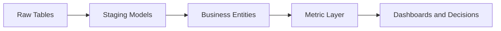

# LinkedIn Post Draft - 2026-08-29

Theme: Analytics Engineering

## Post Copy

A semantic layer is a trust contract between data engineering and the business.

When metrics live in scattered SQL, every dashboard becomes its own interpretation. A strong analytics engineering layer centralizes definitions, tests the assumptions, documents ownership, and gives teams reusable building blocks.

Practical takeaway: Reusable metric definitions are how data teams scale trust.

Portfolio context: This post can link back to the data engineering portfolio at https://kasala95.github.io/data-engineering-portfolio/

Suggested hashtags: #DataEngineering #AnalyticsEngineering #CloudData #DataGovernance #Snowflake #Databricks

## Diagram Documentation

Metric Layer

## Publishing Checklist

- Review the post for tone and accuracy.
- Add one personal sentence based on recent work, learning, or interview preparation.
- Upload the Mermaid diagram as an image or paste the diagram text into a documentation carousel.
- Publish manually on LinkedIn.
- Save the final LinkedIn URL back into this repository if desired.
