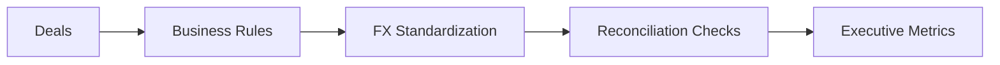

# LinkedIn Post Draft - 2026-08-31

Theme: Revenue Data Trust

## Post Copy

Two revenue dashboards can both be technically correct and still disagree.

The conflict is rarely caused by SQL alone. It is usually hidden in business logic: which close date counts, how multi-contact deals are deduplicated, when currency conversion is applied, how account hierarchies roll up, and which attribution rule wins. When I design a revenue source-of-truth model, I treat those definitions as governed data contracts. The rules are documented, tested, reconciled, and owned before the metric reaches leadership.

Trusted revenue data is engineered through definitions, reconciliation, and ownership.

I documented the architecture and implementation patterns in my public data engineering portfolio: https://kasala95.github.io/data-engineering-portfolio/

Which revenue definition has caused the most debate in your organization?

Suggested hashtags: #DataEngineering #AnalyticsEngineering #DataGovernance #CloudData #DataArchitecture

## Diagram Documentation

Revenue Control Flow

LinkedIn-ready graphic: `generated/2026-08-31-linkedin-graphic.png`

## Publishing Checklist

- Review the post for tone and accuracy.
- Add one personal sentence based on recent work, learning, or interview preparation.
- Upload the generated 1200 x 1200 PNG graphic with the post.
- Publish manually on LinkedIn.
- Save the final LinkedIn URL back into this repository if desired.
