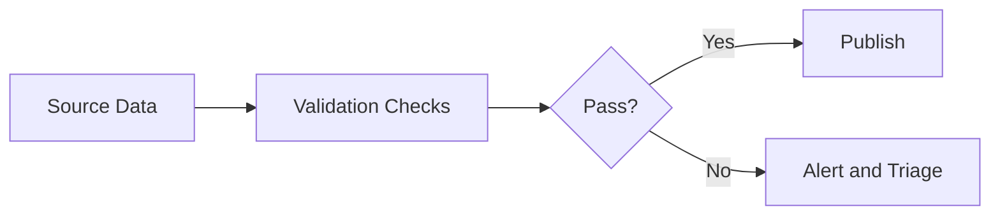

# LinkedIn Post Draft - 2026-09-01

Theme: Data Quality

## Post Copy

Data quality checks are more useful when they explain what failed and who should care.

A failed pipeline tells you something broke. A useful observability layer tells you whether the issue is freshness, duplicate records, missing business keys, invalid ranges, or metric drift. That context shortens incident response and helps business teams understand impact.

Good data quality work turns vague distrust into specific, fixable signals.

I documented the architecture and implementation patterns in my public data engineering portfolio: https://kasala95.github.io/data-engineering-portfolio/

Which data quality signal has been most useful in shortening your incident response?

Suggested hashtags: #DataEngineering #AnalyticsEngineering #DataGovernance #CloudData #DataArchitecture

## Diagram Documentation

Quality Gate

LinkedIn-ready graphic: `generated/2026-09-01-linkedin-graphic.png`

## Publishing Checklist

- Review the post for tone and accuracy.
- Add one personal sentence based on recent work, learning, or interview preparation.
- Upload the generated 1200 x 1200 PNG graphic with the post.
- Publish manually on LinkedIn.
- Save the final LinkedIn URL back into this repository if desired.
