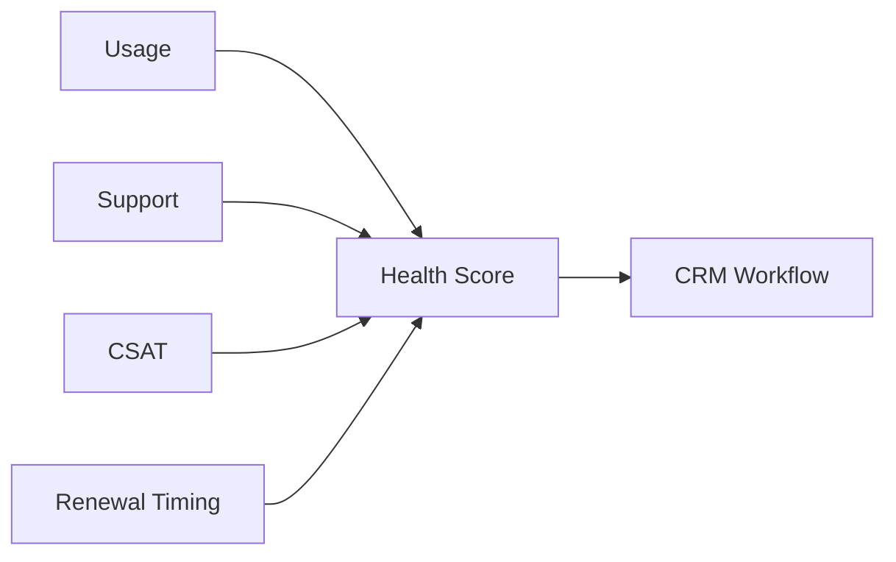

# LinkedIn Post Draft - 2026-09-02

Theme: Account Health

## Post Copy

A useful account health score should be explainable enough for customer teams to act on it.

Account scoring works best when the ingredients are understandable: usage, support burden, customer satisfaction, renewal timing, and account value. If a team cannot explain why a score changed, the score becomes another dashboard number instead of an operational signal.

The best scoring systems support action, not just prediction.

I documented the architecture and implementation patterns in my public data engineering portfolio: https://kasala95.github.io/data-engineering-portfolio/

What makes an account health score genuinely actionable for your customer teams?

Suggested hashtags: #DataEngineering #AnalyticsEngineering #DataGovernance #CloudData #DataArchitecture

## Diagram Documentation

Health Scoring

LinkedIn-ready graphic: `generated/2026-09-02-linkedin-graphic.png`

## Publishing Checklist

- Review the post for tone and accuracy.
- Add one personal sentence based on recent work, learning, or interview preparation.
- Upload the generated 1200 x 1200 PNG graphic with the post.
- Publish manually on LinkedIn.
- Save the final LinkedIn URL back into this repository if desired.
