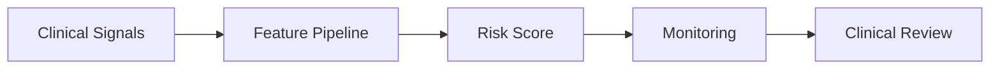

# LinkedIn Post Draft - 2026-09-03

Theme: Healthcare ML

## Post Copy

In healthcare analytics, the model is only one part of the system.

A readmission risk workflow needs secure data handling, feature engineering, batch scoring, monitoring, clinical review, and responsible workflow integration. The engineering around the model often determines whether the output is trusted enough to use.

Healthcare ML succeeds when data engineering, privacy, monitoring, and human review are designed together.

I documented the architecture and implementation patterns in my public data engineering portfolio: https://kasala95.github.io/data-engineering-portfolio/

Which part of the healthcare ML workflow deserves more attention than it usually receives?

Suggested hashtags: #DataEngineering #AnalyticsEngineering #DataGovernance #CloudData #DataArchitecture

## Diagram Documentation

Healthcare Scoring Workflow

LinkedIn-ready graphic: `generated/2026-09-03-linkedin-graphic.png`

## Publishing Checklist

- Review the post for tone and accuracy.
- Add one personal sentence based on recent work, learning, or interview preparation.
- Upload the generated 1200 x 1200 PNG graphic with the post.
- Publish manually on LinkedIn.
- Save the final LinkedIn URL back into this repository if desired.
