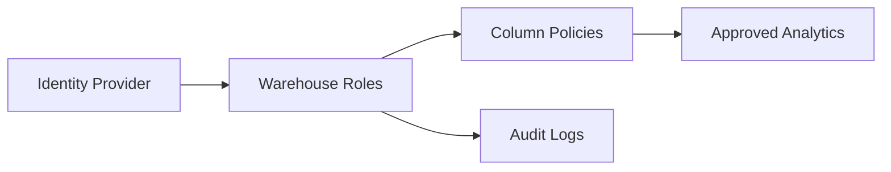

# LinkedIn Post Draft - 2026-09-04

Theme: Data Governance

## Post Copy

Governance should make approved access easier and risky access harder.

Good governance is not only about restricting data. It is about role clarity, automated access updates, column-level controls, auditability, and documentation that helps analysts know what they can use safely.

The best governance systems reduce friction and risk at the same time.

I documented the architecture and implementation patterns in my public data engineering portfolio: https://kasala95.github.io/data-engineering-portfolio/

Where has good governance made approved data access faster for your team?

Suggested hashtags: #DataEngineering #AnalyticsEngineering #DataGovernance #CloudData #DataArchitecture

## Diagram Documentation

Governed Access

LinkedIn-ready graphic: `generated/2026-09-04-linkedin-graphic.png`

## Publishing Checklist

- Review the post for tone and accuracy.
- Add one personal sentence based on recent work, learning, or interview preparation.
- Upload the generated 1200 x 1200 PNG graphic with the post.
- Publish manually on LinkedIn.
- Save the final LinkedIn URL back into this repository if desired.
