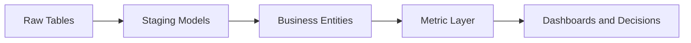

# LinkedIn Post Draft - 2026-09-05

Theme: Analytics Engineering

## Post Copy

A semantic layer is a trust contract between data engineering and the business.

When metrics live in scattered SQL, every dashboard becomes its own interpretation. A strong analytics engineering layer centralizes definitions, tests the assumptions, documents ownership, and gives teams reusable building blocks.

Reusable metric definitions are how data teams scale trust.

I documented the architecture and implementation patterns in my public data engineering portfolio: https://kasala95.github.io/data-engineering-portfolio/

Which metric would benefit most from moving out of dashboard SQL and into a governed semantic layer?

Suggested hashtags: #DataEngineering #AnalyticsEngineering #DataGovernance #CloudData #DataArchitecture

## Diagram Documentation

Metric Layer

LinkedIn-ready graphic: `generated/2026-09-05-linkedin-graphic.png`

## Publishing Checklist

- Review the post for tone and accuracy.
- Add one personal sentence based on recent work, learning, or interview preparation.
- Upload the generated 1200 x 1200 PNG graphic with the post.
- Publish manually on LinkedIn.
- Save the final LinkedIn URL back into this repository if desired.
