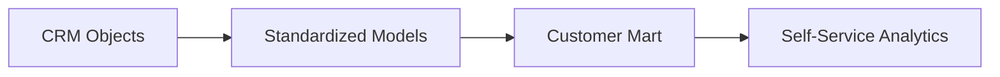

# LinkedIn Post Draft - 2026-09-13

Theme: Customer 360

## Post Copy

A Customer 360 model is not valuable because it has every field. It is valuable because teams trust the definitions.

When I design customer analytics layers, I think in terms of reusable entities: company, contact, deal, ticket, product usage, and lifecycle status. The hard part is rarely the join itself. The hard part is agreeing on ownership, refresh cadence, field definitions, and validation rules so analysts are not rebuilding the same logic in every dashboard.

A good Customer 360 model should reduce repeated questions, not create a larger table with more confusion.

I documented the architecture and implementation patterns in my public data engineering portfolio: https://kasala95.github.io/data-engineering-portfolio/

What is the hardest customer definition your team has had to standardize?

Suggested hashtags: #DataEngineering #AnalyticsEngineering #DataGovernance #CloudData #DataArchitecture

## Diagram Documentation

Customer 360 Flow

LinkedIn-ready graphic: `generated/2026-09-13-linkedin-graphic.png`

## Publishing Checklist

- Review the post for tone and accuracy.
- Add one personal sentence based on recent work, learning, or interview preparation.
- Upload the generated 1200 x 1200 PNG graphic with the post.
- Publish manually on LinkedIn.
- Save the final LinkedIn URL back into this repository if desired.
